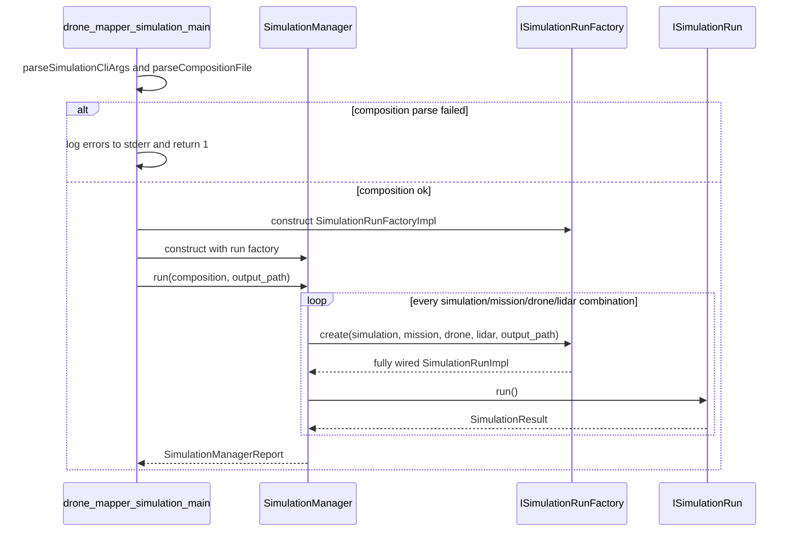
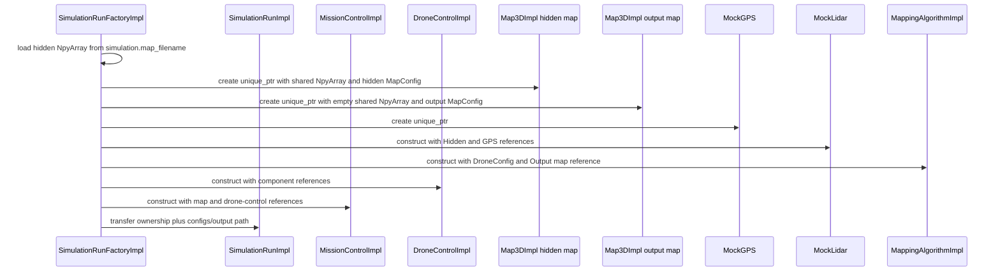
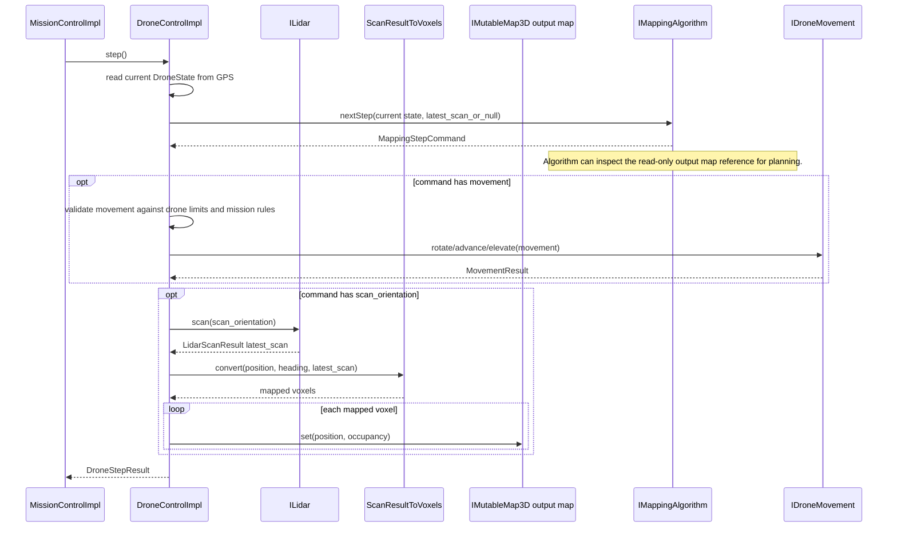
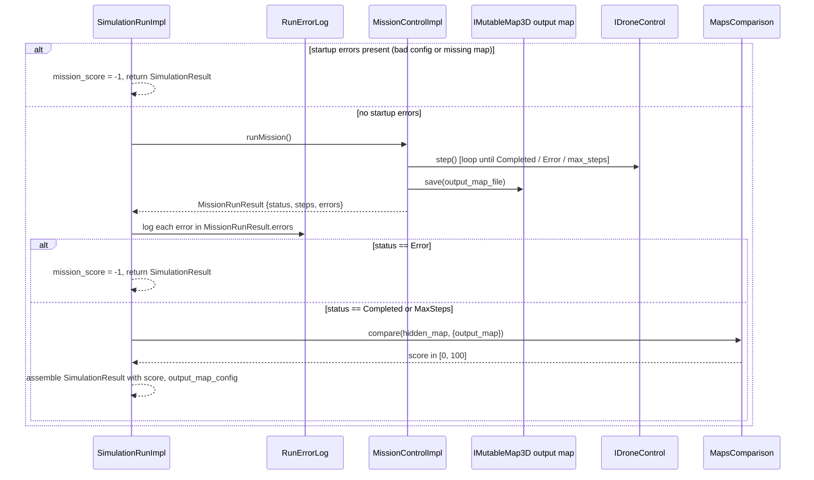
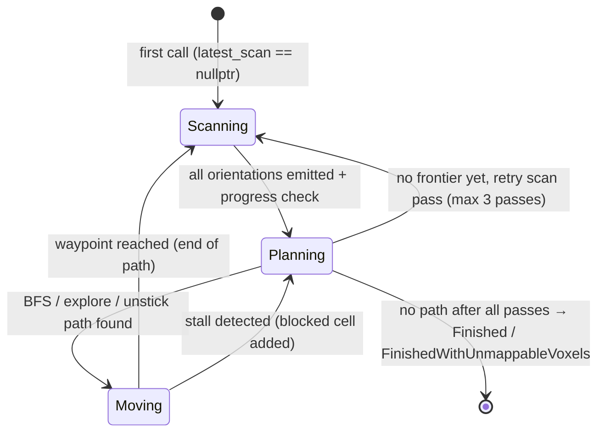

# Assignment 2 Skeleton HLD

This document describes the implemented Assignment 2 design. Orchestration, runtime, scoring, and test isolation are documented below; see **Implemented Components** for current coverage and remaining gaps.

## Main Components

- `SimulationManager` is the top-level runner. It receives `types::SimulationCompositionData`, expands aligned (simulation, mission) pairs × drones × lidars, and aggregates a `types::SimulationManagerReport`.
- `ISimulationRunFactory` is the single construction seam. It creates one fully wired run node for one simulation/mission/drone/LiDAR combination.
- `SimulationRunImpl` owns the full per-node runtime object graph, including maps, hardware-like components, drone control, and mission control. It also carries the simulation/mission config and output map path needed to return `types::SimulationResult`.
- `MissionControlImpl` receives references to the simulation-run-owned maps and drone control, saves the output map, and returns mission-level status/errors.
- `DroneControlImpl` receives required configs and references to simulation-run-owned dependencies, so it is ready at construction.
- `IMap3D` is read-only and exposes voxel lookup plus `types::MapConfig`, which groups boundaries, offset, and resolution. `IMutableMap3D` adds mutation and saving for output maps.
- Public signatures use explicit `types::...` names from focused headers. `SimulationTypes.h` holds simulator-only composition/report types.

## Map Geometry And Results

- `types::MapConfig` is the canonical map-geometry bundle: `MappingBounds`, `Position3D offset`, and `PhysicalLength resolution`.
- `types::SimulationConfigData` provides the hidden map file, hidden map resolution, map offset, initial drone position, and initial heading.
- `Map3DImpl` reads hidden maps as NumPy `uint8` (`0` = Empty, `>= 1` = Occupied) and output maps as `int8` (full `VoxelOccupancy` enum). Dtype is distinguished via `NpyArray::Type()` (`'u'` vs `'i'`). See `docs/map3d_impl_contract.md`.
- `types::MissionConfigData` holds mission behavior, optional mapping `boundaries` from `mission_config` YAML (20.6), and requested output resolution parameters. When boundaries are unset, the output map inherits hidden-map bounds.
- `types::MissionRunResult` contains mission status, step count, and mission-level errors.
- `types::SimulationResult` contains one run's configs, mission results, output map file, output map config, resolution request status, and final score.
- `types::SimulationManagerReport` is the top-level aggregate over all generated `SimulationResult` runs.

## Class Diagram

```mermaid
classDiagram
    direction LR

    class ISimulation {
        <<interface>>
        +run(composition, output_path) report
    }

    class ISimulationRun {
        <<interface>>
        +run() result
    }

    class ISimulationRunFactory {
        <<interface>>
        +create(sim, mission, drone, lidar, output_path) run
    }

    class IMissionControl {
        <<interface>>
        +runMission() result
    }

    class IDroneControl {
        <<interface>>
        +step() step_result
        +state() state
    }

    class ILidar {
        <<interface>>
        +scan(orientation) scan
    }

    class IGPS {
        <<interface>>
        +position() position
        +heading() orientation
    }

    class IDroneMovement {
        <<interface>>
        +rotate(direction, angle) move_result
        +advance(distance) move_result
        +elevate(distance) move_result
    }

    class IMappingAlgorithm {
        <<interface>>
        +nextStep(state, latest_scan) step_command
    }

    class IMap3D {
        <<interface>>
        +atVoxel(pos) occupancy
        +getMapConfig() config
    }

    class IMutableMap3D {
        <<interface>>
        +set(pos, value) void
        +save(output_file) void
    }

    class SimulationManager {
        -unique_ptr~ISimulationRunFactory~ run_factory_
        +SimulationManager(run_factory)
        +run(composition, output_path) report
    }

    class SimulationRunFactoryImpl {
        -int next_run_id_
        +create(sim, mission, drone, lidar, output_path) run
    }

    class SimulationRunImpl {
        -unique_ptr~const IMap3D~ hidden_map_
        -unique_ptr~IMutableMap3D~ output_map_
        -unique_ptr~IGPS~ gps_
        -unique_ptr~IDroneMovement~ movement_
        -unique_ptr~ILidar~ lidar_
        -unique_ptr~IMappingAlgorithm~ mapping_algorithm_
        -unique_ptr~IDroneControl~ drone_control_
        -unique_ptr~IMissionControl~ mission_control_
        -SimulationConfigData simulation_config_
        -MissionConfigData mission_config_
        -path output_map_file_
        +SimulationRunImpl(runtime_objects, configs, output_file)
        +run() simulation_result
    }

    class MissionControlImpl {
        -MissionConfigData mission_
        -DroneConfigData drone_
        -IMap3D& hidden_map_
        -IMutableMap3D& output_map_
        -IDroneControl& drone_control_
        -path output_map_file_
        +MissionControlImpl(mission, drone, hidden_map&, output_map&, drone_control&, output_file)
        +runMission() result
    }

    class DroneControlImpl {
        -DroneConfigData drone_
        -MissionConfigData mission_
        -ILidar& lidar_
        -IGPS& gps_
        -IDroneMovement& movement_
        -IMutableMap3D& output_map_
        -IMappingAlgorithm& mapping_algorithm_
        +DroneControlImpl(drone, mission, lidar&, gps&, movement&, output_map&, mapping_algorithm&)
        +step() step_result
        +state() state
    }

    class MockLidar {
        -LidarConfigData config_
        -IMap3D& hidden_map_
        -IGPS& gps_
        +MockLidar(config, map&, gps&)
        +scan(orientation) scan
    }

    class Map3DImpl {
        -shared_ptr~NpyArray~ map_
        -MapConfig config_
        +Map3DImpl(shared_ptr~NpyArray~ map_ptr)
        +Map3DImpl(shared_ptr~NpyArray~ map_ptr, MapConfig config)
        +atVoxel(pos) occupancy
        +getMapConfig() config
        +set(pos, value) void
        +save(output_file) void
    }

    class MapsComparison {
        +compare(origin&, vector~IMap3D*~ targets) vector~double~
    }

    class MapConfig {
        +MappingBounds boundaries
        +Position3D offset
        +PhysicalLength resolution
    }

    class SimulationResult {
        +SimulationConfigData simulation_config
        +MissionConfigData mission_config
        +ResolutionRequestStatus resolution_request_status
        +vector~MissionRunResult~ mission_results
        +path output_map_file
        +MapConfig output_map_config
        +double mission_score
    }

    class SimulationManagerReport {
        +string generated_at_utc
        +string metric
        +tuple~double,double~ score_range
        +int error_score
        +vector~SimulationResult~ runs
    }

    ISimulation <|.. SimulationManager
    ISimulationRunFactory <|.. SimulationRunFactoryImpl
    ISimulationRun <|.. SimulationRunImpl
    IMissionControl <|.. MissionControlImpl
    IDroneControl <|.. DroneControlImpl
    ILidar <|.. MockLidar
    IMap3D <|-- IMutableMap3D
    IMutableMap3D <|.. Map3DImpl

    SimulationManager --> ISimulationRunFactory
    SimulationRunFactoryImpl --> SimulationRunImpl : transfers ownership
    SimulationRunImpl --> IMap3D : owns hidden map
    SimulationRunImpl --> IMutableMap3D : owns output map
    SimulationRunImpl --> IGPS
    SimulationRunImpl --> IDroneMovement
    SimulationRunImpl --> ILidar
    SimulationRunImpl --> IMappingAlgorithm
    SimulationRunImpl --> IDroneControl
    SimulationRunImpl --> IMissionControl
    MissionControlImpl --> IMap3D : hidden map reference
    MissionControlImpl --> IMutableMap3D : output map reference
    MissionControlImpl --> IDroneControl : reference
    DroneControlImpl --> ILidar : reference
    DroneControlImpl --> IGPS : reference
    DroneControlImpl --> IDroneMovement : reference
    DroneControlImpl --> IMutableMap3D : reference
    DroneControlImpl --> IMappingAlgorithm : reference
    MockLidar --> IMap3D : hidden map reference
    MapsComparison --> IMap3D
    IMap3D --> MapConfig
    SimulationRunImpl --> SimulationResult
    SimulationManager --> SimulationManagerReport
    SimulationManagerReport --> SimulationResult
    SimulationResult --> MapConfig
```

## Top-Level Run Flow

## Factory Wiring Flow

##  Mission Run Flow

The first step calls `nextStep(state, nullptr)` because no LiDAR result exists yet. Each step command may request movement, a scan, both, or neither. If both are requested, movement is validated and executed first, then the scan is performed from the updated state and written into the output map.

##  Single Simulation Run Flow

## Algorithm State Machine (MappingAlgorithmImpl)

`MappingAlgorithmImpl::nextStep` drives a three-phase state machine. The output map is read-only from the algorithm's perspective; the drone writes scan results into it via `DroneControlImpl`.

### Scanning phase

- Builds a set of scan orientations covering a hemisphere around the current position (circle rings with angular spacing derived from lidar `z_max` and drone radius).
- Emits one orientation per `nextStep` call.
- After all orientations are emitted, counts newly mapped cells. If no progress after multiple passes, forces a transition to Planning even without new data.

### Planning phase

- Calls `MappingAlgorithmFrontier::findPath` — BFS through confirmed-empty cells on the output map toward the nearest unmapped frontier.
- If no frontier is reachable directly, tries `findExplorePath` (nearest unknown neighbor ignoring passability) then `findUnstickPath` (short path out of a blocked region).
- A retry counter (`scan_pass`) allows up to `kMaxScanPassIndex` (2) re-scans before giving up. Each retry expands the proximity sphere used to test for local unknown voxels.
- When no path is found after all retries: returns `AlgorithmStatus::Finished` (all voxels mapped) or `AlgorithmStatus::FinishedWithUnmappableVoxels` (unknown voxels remain but are unreachable).

### Moving phase

- Follows the waypoints in `current_path` by emitting rotate/advance/elevate commands toward each waypoint using `movementToward`.
- Stall detection: if position does not change for `kMaxMovingStallTicks` (8) consecutive steps, the current waypoint cell is added to `blocked_cells` and the algorithm transitions back to Planning.

## Orchestration and I/O Components

### SimulationManager

`SimulationManager::run()` expands aligned (simulation, mission) pairs × drones × lidars in loop order. For each combination it calls `ISimulationRunFactory::create(...)`, executes `ISimulationRun::run()`, and collects a `types::SimulationResult`. It tracks a 1-based `run_id` and `config_indices` (pair index for both simulation and mission, plus drone/lidar indices). After all runs complete it assembles `types::SimulationManagerReport` (timestamp, metric, score range, error score) and writes `simulation_output.yaml` via `io::writeSimulationOutputYaml`.

### SimulationRunFactoryImpl

Each `create(...)` call assigns the next `run_id` from `next_run_id_`, creates `output_results/run_NNNN/` via `io::runOutputDir`, and opens the per-run `error.log` via `io::runErrorLog`. It calls `appendConfigLoadErrors` for all four config types (simulation, mission, drone, lidar) and logs any parse errors immediately. When the simulation config is valid it calls `loadHiddenMap`, which returns `MAP_FILE_NOT_FOUND` on a missing or corrupt `.npy`. It wires the full DI graph: `MockGPS` → `MockMovement` + `MockLidar` → `MappingAlgorithmImpl` → `DroneControlImpl` → `MissionControlImpl`, then transfers ownership into `SimulationRunImpl` along with configs, the output map path, and any startup errors.

### SimulationRunImpl

Two execution paths. If startup errors are present, `run()` returns immediately with `mission_score: -1` and a `MissionRunResult` in `Error` status — no mission loop runs. Otherwise it calls `mission_control_->runMission()`, mirrors mission errors to the per-run `error.log` via `logMissionErrors`, copies `output_map_config` from the output map, and scores via `MapsComparison::compare` when the mission completes or hits `max_steps`. On `MissionRunStatus::Error` it returns `mission_score: -1`. `resolution_request_status` is derived from `output_mapping_resolution_factor`.

### CLI / main

`drone_mapper_simulation_main.cpp` parses CLI args via `io::parseSimulationCliArgs` (composition YAML path and output path, with CWD defaults). It loads the composition via `io::parseCompositionFile` using `io::StderrErrorLog`. On parse failure it logs errors to stderr and returns 1 without writing output files. On success it constructs `SimulationRunFactoryImpl`, runs `SimulationManager::run(...)`, and prints the run count to stdout.

### Error Logger / I/O

- `io::RunErrorLog` — per-run file at `output_results/run_NNNN/error.log`; each `log()` call writes one line and flushes immediately.
- `io::StderrErrorLog` — composition-level errors (missing or unparseable composition YAML); also immediate flush.
- `io::RunPathHelpers` — shared path helpers: `runOutputDir`, `runOutputMap`, `runErrorLog`.

Error log line format: `<ISO-8601 UTC> <ERROR_CODE> <user-facing message>`. Runtime codes only — not rubric codes like `e05` or `b06`.

### Missing-input handling

| Failure | Error code | Outcome |
|---------|-----------|---------|
| Composition YAML missing/unparseable | (stderr, no runtime code) | `main` returns 1; no output files |
| Individual config YAML parse error | `config_load_error.code` from parsed config | `mission_score: -1`; run continues |
| Hidden map missing or corrupt `.npy` | `MAP_FILE_NOT_FOUND` | `mission_score: -1`; run continues |
| Mission loop error | codes from `MissionRunResult.errors` | `mission_score: -1`; run continues |

## Scoring (MapsComparison)

`MapsComparison::compare(origin, targets)` returns a score in [0, 100] per target map using the union-of-known-cells model ported from the ex1 `Scorer`.

**Algorithm:**
1. Enumerate every grid-centre position in the **reference** (`origin`) map's bounds at its resolution.
2. For each position where the reference has a known occupancy (Empty, Occupied, or PotentiallyOccupied), record the quantized grid key and check whether the target map agrees at that position.
3. Enumerate every grid-centre position in the **target** map's bounds. For each position with known occupancy that maps to a grid key not already covered by the reference, add it as an additional "total" cell.
4. Score = `correct / total × 100`. If `total == 0`, returns `100` (trivially identical empty maps).

The `maps_comparison` binary wraps this: prints the score to stdout only; on error prints `-1` to stdout and a diagnostic message to stderr.

## Bug-Isolation Coverage (B-Owned Suites)

Each B-owned GTest suite is scoped to a single component so that a bug injected into that component fails only its own suite (and the `Integration.*` catch-all), leaving A-owned suites green.

| Suite | Key failure modes isolated |
|-------|---------------------------|
| `DroneControl.*` | scan-before-movement ordering bug; step-0 null-scan contract; output-map not written after scan; movement limit bypass; `state()` stale read; latest-scan not forwarded on subsequent steps |
| `MissionControl.*` | loop-continues-after-error; max-steps off-by-one; output map not saved on error/max-steps branch; `save` failure silenced; error message dropped |
| `MappingAlgorithm.*` | algorithm never terminates (no frontier guard); scan phase exits early; movement combined with scan in one step; `Finished` status not re-emitted after first finish; frontier BFS path wrong or absent |
| `MapsComparison.*` | union double-counted; correct count off-by-one; target-only unknown cells scored wrong; out-of-bounds cells included; CLI stdout contains extra text beyond score; CLI exit path on missing files |
| `Integration.*` | end-to-end wiring: factory loads map, wires all components, run produces non-error score; mock algorithm receives calls in correct order; instructor focused compositions complete within timeout with `mission_score >= 90` |

**Isolation guarantee:** A bug injected into `MapsComparison::compare` (e.g. wrong denominator) will fail `MapsComparison.*` and affect `SimulationRun.*` score assertions and `Integration.*`, but must not touch `DroneControl.*`, `MissionControl.*`, or `MappingAlgorithm.*` — because those suites use a `MockMapsComparison` or avoid calling `compare` directly.

## Bug-Isolation Coverage (A-Owned Suites)

Each A-owned GTest suite is scoped to orchestration, I/O, or sensor mock behavior so that a bug injected into that layer fails its own suite (and `Integration.*` when end-to-end), leaving B-owned runtime suites green when mocks isolate the dependency.

| Suite | Key failure modes isolated |
|-------|---------------------------|
| `SimulationManager.*` | pair expansion skips combinations or over-expands (independent sim×mission cartesian); failed run aborts whole composition; `run_id` / `config_indices` mismatch; `simulation_output.yaml` missing or wrong schema; report metadata (`generated_at_utc`, `metric`, `error_score`) wrong; invalid composition ref not scored -1 |
| `SimulationRun.*` | factory output layout wrong (`run_NNNN/` paths); hidden map not loaded from disk; missing/corrupt `.npy` not logged or not scored -1; invalid per-config YAML not scored -1; startup errors do not skip mission; mission errors not mirrored to `error.log`; `mission_score: -1` on error; max-steps run not scored |
| `MockLidar.*` | open-beam miss returns wrong length (not max-range cm); obstacle at `z_max` not detected; obstacle one voxel before max not detected; obstacle beyond max falsely detected; obstacle before `z_min` returns non-zero; zero `fov_circles` returns non-empty scan |
| `YamlConfigParser.*` | config fields not parsed; missing file does not set `config_load_error`; composition mis-aligns simulations/missions; missing composition file not reported |
| `SimulationCliTest.*` | default composition path wrong; explicit paths not honored; missing composition file parse failure not detected |
| `RunErrorLog.*` | log line format wrong; entries not flushed immediately; parent directory not created; multiple entries not appended |

**Isolation guarantee:** A bug injected into `SimulationManager::run` (e.g. abort on first failure) will fail `SimulationManager.*` and `Integration.*`, but must not touch `DroneControl.*`, `MissionControl.*`, `MappingAlgorithm.*`, or `MapsComparison.*` when those suites use mock factories or avoid the manager loop. A bug in `MockLidar::traceBeam` fails `MockLidar.*`, scan-related `DroneControl.*` tests (which wire the real `MockLidar`, not a GMock), and `Integration.*` — but not pure movement-order or step-0 null-scan `DroneControl.*` tests that do not assert on scan distances or voxel mapping.

## Implemented Components

- `DroneControlImpl::step` — movement-before-scan pipeline with `ScanResultToVoxels`; marks drone footprint empty in output map before calling algorithm.
- `MappingAlgorithmImpl::nextStep` — Scanning → Planning → Moving state machine with BFS frontier (`MappingAlgorithmFrontier`); stall detection; multi-pass rescue scan.
- `MissionControlImpl::runMission` — loops `IDroneControl::step()` until `DroneStepStatus::Completed`, `Error`, or `max_steps`; always saves output map on exit; returns `MissionRunResult` with status, step count, and any errors.
- `SimulationRunImpl::run()` — short-circuits to `score: -1` on startup errors; delegates to `MissionControlImpl::runMission()`; mirrors mission errors to per-run `error.log`; scores via `MapsComparison` on `Completed`/`MaxSteps`; returns `score: -1` on `MissionRunStatus::Error`.
- `SimulationRunFactoryImpl::create` — loads hidden `.npy` map, allocates output map at requested resolution, wires `MockGPS` / `MockMovement` / `MockLidar` / `MappingAlgorithmImpl` / `DroneControlImpl` / `MissionControlImpl` into `SimulationRunImpl`; logs and stores startup errors.
- `SimulationManager::run()` — aligned (simulation, mission) pairs × drones × lidars; tracks `run_id` / `config_indices`; writes `simulation_output.yaml`.
- `drone_mapper_simulation_main` — CLI arg parsing via `io::parseSimulationCliArgs`; composition loading via `io::parseCompositionFile`; logs startup failures to stderr; returns gracefully.
- YAML parsers (`src/io/`) — drone, mission, lidar, simulation, and composition; nested composition expands to aligned `simulations[]`/`missions[]` pairs.
- `MapsComparison::compare` — union-of-known-cells scoring; used by `SimulationRunImpl` and `maps_comparison` CLI.

**Remaining gaps:**

- Movement legality checks at simulation-run level (future).
